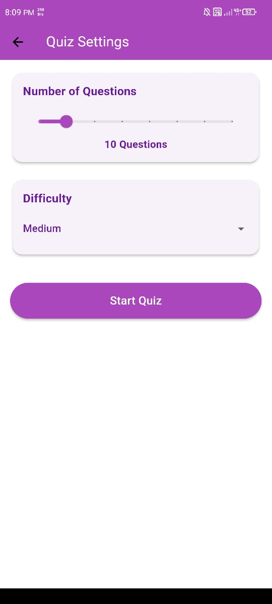

# Quiz App

This is a mobile quiz application built using Flutter, with a backend powered by a Go server and MongoDB for database management. The app allows users to select the number of questions and difficulty level for the quiz. The backend is deployed using Vercel.


<br/>

<br/>

<br/>

<br/>

<br/>

## Features

- **Customizable Quizzes:** Users can choose the number of questions and difficulty level.
- **Hint System:** Offers hints for difficult questions.
- **Exit Quiz:** Allows users to exit the quiz at any time.
- **Real-Time Updates:** Fetches quiz questions from the backend in real-time.

## Technology Stack

- **Frontend:** Flutter
- **Backend:** Go
- **Database:** MongoDB
- **Deployment:** Vercel

## Setup and Installation

### Prerequisites

- Flutter SDK
- Go
- MongoDB
- Vercel Account

### Backend Setup

1. Clone the repository:
   ```bash
   git clone https://github.com/Rohith2006/quiz-app.git
   ```
2. Navigate to the backend directory:
   ```bash
   cd quiz-app/app-backend
   ```
3. Install dependencies:
   ```bash
   go mod tidy
   ```
4. Run the Go server locally:
   ```bash
   go run main.go
   ```

### Frontend Setup

1. Navigate to the Flutter app directory:
   ```bash
   cd quiz-app/app-frontend
   ```
2. Install dependencies:
   ```bash
   flutter pub get
   ```
3. Run the app on an emulator or physical device:
   ```bash
   flutter run
   ```

### API Endpoint

#### Fetch Random Quiz Questions

**Endpoint:**  
`GET /get-random-questions`

**Base URL:**  
`https://go-server-theta.vercel.app`

**Full URL:**  
`https://go-server-theta.vercel.app/get-random-questions?difficulty=${quiz.difficulty.toLowerCase()}&num=${quiz.numberOfQuestions}`

**Description:**  
Fetches a specified number of random quiz questions filtered by the given difficulty level.

**Query Parameters:**

- `difficulty` (string): The difficulty level of the questions. Example values: `easy`, `medium`, `hard`.
- `num` (integer): The number of quiz questions to retrieve.

**Sample Request:**

```http
GET https://go-server-theta.vercel.app/get-random-questions?difficulty=medium&num=10
```

**Sample Response:**

```json
{
  "questions": [
   {
    "id": "66c0be7044e497c24f50bd81",
    "question": "Which of the following is a primary color?",
    "option_a": "Green",
    "option_b": "Orange",
    "option_c": "Blue",
    "option_d": "Purple",
    "correct_answer": "C",
    "difficulty": "medium",
    "hint": "It is one of the three basic colors."
  },
  {
    "id": "66c0be7044e497c24f50bdc2",
    "question": "Which famous artist painted the Mona Lisa?",
    "option_a": "Vincent van Gogh",
    "option_b": "Leonardo da Vinci",
    "option_c": "Pablo Picasso",
    "option_d": "Claude Monet",
    "correct_answer": "B",
    "difficulty": "medium",
    "hint": "He was an Italian Renaissance artist."
  }
    // More questions
  ]
}
```

**Notes:**

- Ensure the `difficulty` parameter is in lowercase.
- The `num` parameter should be a positive integer.

Feel free to adjust the content according to your needs!

**APK:**

https://drive.google.com/file/d/19pbyYynTK_uTfDXGOnapXB_bqb-NOsFc/view?usp=sharing

